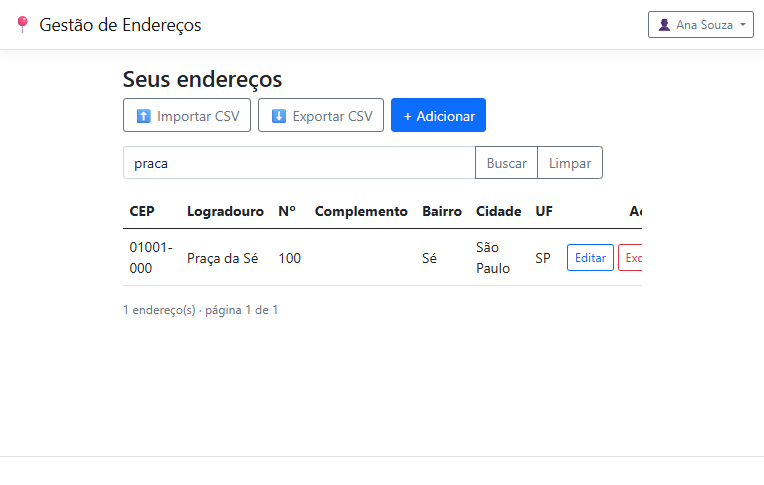

# Gestão de Endereços

Aplicação web em **C# / ASP.NET Core MVC** para o teste técnico de desenvolvedor (AeC). Permite
**login**, **gerenciar um CRUD de endereços** (cadastro manual ou **autopreenchimento por CEP via
[ViaCEP](https://viacep.com.br/)**) e **exportar para CSV** — e vai além, com gestão de usuários,
importação por planilha e busca tolerante, mantendo o código limpo e legível.

## 🌐 Demo ao vivo
**http://129.151.35.75:8080** — entre com **`ana`** (administrador) ou **`bruno`** · senha `Senha@123`.

> A demo roda em **duas instâncias Oracle Cloud na mesma rede privada**: a aplicação (ASP.NET Core,
> serviço `systemd`) numa instância ARM e o banco **SQL Server** (Azure SQL Edge — o mesmo motor)
> numa instância x86, acessível **apenas pela rede interna** (porta 1433 não exposta à internet). O
> provider é selecionável por configuração (`Database:Provider`); o `docker-compose` sobe **SQL
> Server 2022** para rodar localmente, e **SQLite** está disponível para um clone sem dependências.

## Funcionalidades
- **Autenticação** por cookie. Novas contas são criadas **apenas pelo administrador** (sem autocadastro).
- **CRUD de endereços** por usuário, com **isolamento de dados** garantido por construção.
- **Autopreenchimento por CEP** (ViaCEP, com *cache* e degradação graciosa).
- **Busca tolerante** — ignora **maiúsculas e acentos** e tolera **erros de digitação**
  (ex.: `rua`, `RUA` e `rau` encontram "Rua"; `praca` encontra "Praça").
- **Paginação** da listagem (escala para milhares de registros).
- **Exportação CSV** (UTF-8 com BOM) e **importação CSV** com validação por linha + **modelo** para baixar.
- **Gestão de usuários** (área administrativa): perfil, troca de senha, e CRUD de usuários com
  redefinição de senha (papel **Admin**).
- **Segurança**: rate limiting no login, política de senha forte, cabeçalhos de segurança (CSP etc.).

## Telas
| Login | Lista com busca e paginação |
|-------|-----------------------------|
|  |  |

| Autopreenchimento por CEP (foco pula p/ Número) | Busca tolerante (ignora acento/caixa/typo) |
|-------------------------------------------------|--------------------------------------------|
|  |  |

| Importação CSV (válidas/inválidas com motivo) | Área administrativa de usuários |
|-----------------------------------------------|--------------------------------|
|  |  |

## 📚 Documentação
- **[Defesa técnica completa — PDF](docs/DEFESA_TECNICA.pdf)** · [versão Markdown](docs/DEFESA_TECNICA.md)
  — atendimento requisito a requisito, segurança, escalabilidade, uso de IA e roadmap.
- **[Dossiê resumido — PDF](docs/DOSSIE_AVALIADOR.pdf)** · [Markdown](docs/DOSSIE_AVALIADOR.md)
- **[Ambiente produtivo na Oracle Cloud](docs/INFRA-OCI.md)** — app + SQL Server (Azure SQL Edge) em rede privada
- **[Board do projeto (registro de atividades)](docs/board-projeto.png)** — quadro estilo Trello da sprint, itens tipados e pontuados
- **Planejamento:** [requisitos](docs/planejamento/00-requisitos-originais.md) ·
  [plano diretor](docs/planejamento/01-plano-diretor.md) ·
  [ADRs](docs/planejamento/02-decisoes-arquiteturais-adr.md) ·
  [backlog](docs/planejamento/03-backlog-execucao.md)
- **Evidências** (capturas de validação): [`docs/evidencias/`](docs/evidencias/)
- **Planilha de exemplo p/ importação:** [`docs/exemplos/`](docs/exemplos/)

## Stack
- **.NET 8 LTS** · ASP.NET Core **MVC** (Razor) · **EF Core 8** (Code-First) · **SQL Server** (SQLite opcional)
- **Bootstrap 5** · **JavaScript vanilla** · **CsvHelper**
- Testes: **xUnit** · **Moq** · **SQLite in-memory** · `WebApplicationFactory`

> A sugestão "ASP.NET MVC" do enunciado foi interpretada como **ASP.NET Core MVC (.NET 8 LTS)**.

## Como rodar
**Docker (recomendado — sobe SQL Server + app):**
```bash
docker compose up --build      # http://localhost:8080
```
**.NET SDK local (SQL Server LocalDB/Express/container):**
```bash
cd src/GestaoEnderecos && dotnet run
```
Na primeira execução o schema é criado e dois usuários de demonstração são populados. Alternativa:
executar [`db/scripts/01-create-tables.sql`](db/scripts/01-create-tables.sql).

## Testes
```bash
dotnet test
```
**86 testes** cirúrgicos: hashing e política de senha, normalização de CEP/UF, integração ViaCEP
(sucesso/erro/timeout), CSV (escaping/BOM) e *round-trip* export↔import, **busca tolerante
(caixa/acento/typo) em SQLite**, **isolamento entre usuários (leitura e escrita, por serviço e por
HTTP)**, cadastro, autorização de admin, importação (incl. carga de 1.000 linhas) e paginação.

## Banco de dados
DDL entregue em [`db/scripts/01-create-tables.sql`](db/scripts/01-create-tables.sql) (fonte de
verdade da estrutura). O EF Core Code-First é usado no desenvolvimento.

## Estrutura
```
src/GestaoEnderecos/
  Controllers/  Account (login/cadastro/perfil), Enderecos (CRUD+CEP+CSV+import), Usuarios (admin), Home
  Services/     Autenticacao, Usuario, Endereco, EnderecoImport, ViaCep, CsvExporter
  Data/         AppDbContext (filtro global + TextoBusca), CurrentUser, DbSeeder
  Models/ ViewModels/ Views/ wwwroot/
tests/GestaoEnderecos.Tests/   Unit + Integration (86 testes)
db/scripts/                    DDL
docs/                          Documentação, evidências e exemplos
```

## Decisões de arquitetura (resumo — detalhes nos ADRs)
- **Monólito bem organizado** em vez de Clean Architecture multi-projeto (o EF Core já é o repositório).
- **`PasswordHasher` nativo** (PBKDF2) — segurança sem reinventar criptografia.
- **Isolamento por usuário via *EF Global Query Filter*** — IDOR impossível por construção.
- **Busca normalizada** (`TextoBusca` minúsculo/sem acento, mantido no `SaveChanges`) + fallback
  **Damerau-Levenshtein** para typos — porque o `LIKE` do SQLite é sensível a caixa/acento.
- **ViaCEP por endpoint interno** com *cache*; **CSV com CsvHelper** (UTF-8+BOM).

## Segurança (resumo — capítulo completo na Defesa Técnica)
PBKDF2 para senhas; rate limiting no login; política de senha forte (≥8, 3 classes); CSRF
(antiforgery) em todas as mutações; XSS (encoding do Razor + CSP); SQL injection (EF parametrizado);
cabeçalhos de segurança (CSP, nosniff, X-Frame-Options, Referrer-Policy); isolamento por usuário.

## O que ficou de fora (de propósito, com roadmap na Defesa Técnica)
EF Migrations (usa `EnsureCreated` para simplicidade), lockout persistente por usuário, verificação
contra senhas vazadas, observabilidade, HTTPS+domínio na demo, *streaming*/bulk para milhões de linhas.

## Convenções de commit
Um commit por funcionalidade, além de commits de suporte (scaffold, docs, segurança). O histórico
conta a construção do produto.
