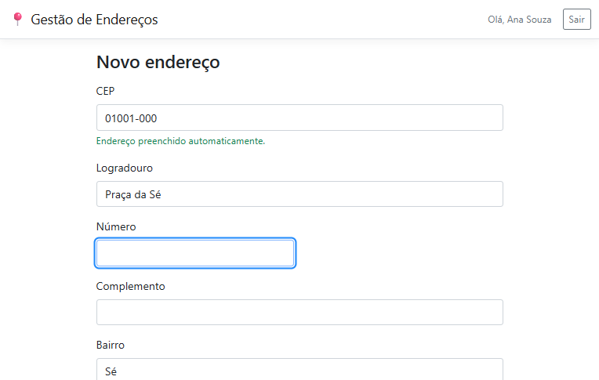
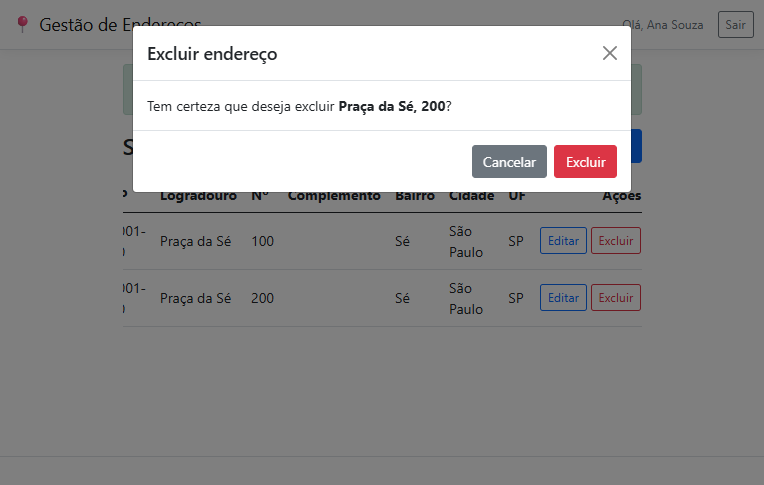
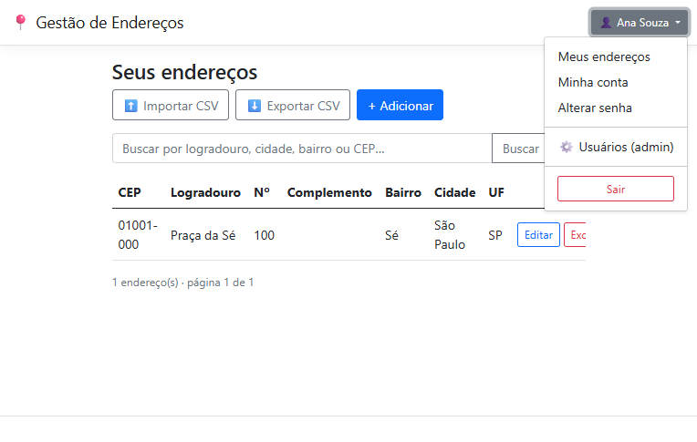
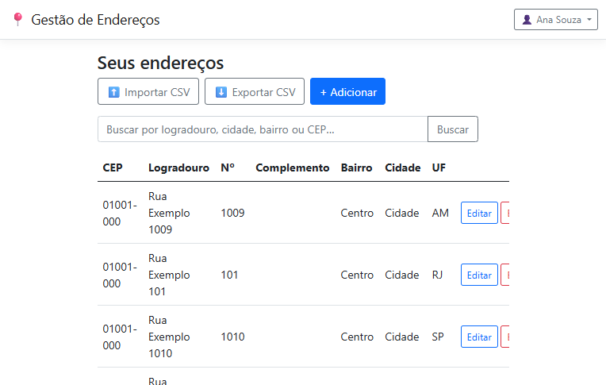

# Gestão de Endereços

Aplicação web em **C# / ASP.NET Core MVC** para o teste técnico de desenvolvedor. Permite
**login**, **gerenciar um CRUD de endereços** (cadastro manual ou **autopreenchimento por CEP via
[ViaCEP](https://viacep.com.br/)**) e **exportar os endereços para CSV**.

> Como **extra** (além do enunciado), há também **importação de endereços via planilha CSV** com
> validação por linha — importa as válidas e reporta as inválidas com a linha e o motivo.
> Veja a planilha de exemplo em [`docs/exemplos/`](docs/exemplos/).

Implementa exatamente o escopo proposto — robusto, sem *overengineering*. A meta é um código que um
sênior reconheça pela qualidade e um júnior leia sem esforço.

## 🌐 Demo ao vivo
**http://129.151.35.75:8080** — entre com **`ana`** ou **`bruno`** (senha `Senha@123`).

> A demo roda em uma instância Oracle Cloud (ARM) como serviço `systemd`, usando **SQLite** por
> simplicidade e custo zero. O repositório e o `docker-compose` usam **SQL Server** (o provider é
> selecionável por configuração — `Database:Provider`), mantendo o deliverable fiel ao enunciado.

## Telas

| Login | Lista de endereços |
|-------|--------------------|
|  |  |

| Autopreenchimento por CEP (foco pula p/ Número) | Confirmação de exclusão |
|-------------------------------------------------|-------------------------|
|  |  |

**Importação CSV — válidas importadas, inválidas reportadas com linha e motivo**


| Menu do usuário | Área administrativa de usuários |
|-----------------|--------------------------------|
|  |  |

**Listagem com busca e paginação (em escala)**



## Stack
- **.NET 8 LTS** · ASP.NET Core **MVC** (Razor)
- **Entity Framework Core 8** (Code-First) · **SQL Server**
- **Bootstrap 5** · **JavaScript vanilla** (sem framework de front)
- Testes: **xUnit** · **Moq** · **SQLite in-memory** · `WebApplicationFactory`

> A sugestão "ASP.NET MVC" do enunciado foi interpretada como **ASP.NET Core MVC (.NET 8 LTS)**,
> o padrão atual e suportado.

## Como rodar

### Opção 1 — Docker (recomendado, zero configuração)
Único pré-requisito: **Docker**. Sobe o SQL Server **e** a aplicação com um comando:

```bash
docker compose up --build
```
Aguarde o SQL Server ficar saudável; a aplicação cria o schema e popula os usuários de
demonstração automaticamente. Acesse **http://localhost:8080**. Para encerrar: `docker compose down`
(use `docker compose down -v` para apagar também o volume do banco).

### Opção 2 — .NET SDK local
Pré-requisitos: **.NET 8 SDK** e **SQL Server** (LocalDB, Express ou container).

```bash
# (Opcional) ajustar a connection string — o padrão usa LocalDB.
# Em outro servidor, prefira User-Secrets (nunca commitar segredos):
cd src/GestaoEnderecos
dotnet user-secrets init
dotnet user-secrets set "ConnectionStrings:Default" "Server=SEU_SERVIDOR;Database=GestaoEnderecos;User Id=...;Password=...;TrustServerCertificate=True"
dotnet run
```

Em qualquer opção, na primeira execução a aplicação **cria o schema e popula dois usuários de
demonstração** automaticamente. Como alternativa, o schema pode ser criado pelo script
[`db/scripts/01-create-tables.sql`](db/scripts/01-create-tables.sql).

### Credenciais de demonstração
Dois usuários (para você ver o **isolamento de dados** funcionando entre contas):

| Usuário | Senha       |
|---------|-------------|
| `ana`   | `Senha@123` |
| `bruno` | `Senha@123` |

## Testes
```bash
dotnet test
```
São **36 testes** cirúrgicos cobrindo o que tem risco real: hashing de senha, normalização de
CEP, integração ViaCEP (sucesso, CEP inexistente, timeout/erro), geração de CSV (escaping/BOM),
**isolamento entre usuários (leitura e escrita)** e o **fluxo autenticado ponta a ponta**
(login → criar → listar → exportar) via `WebApplicationFactory`.

## Banco de dados
O script de criação das tabelas (entregável do teste) está em
[`db/scripts/01-create-tables.sql`](db/scripts/01-create-tables.sql). É a fonte de verdade
entregue; o EF Core Code-First é usado no desenvolvimento.

## Estrutura
```
src/GestaoEnderecos/      Aplicação MVC
  Controllers/            Account (login), Enderecos (CRUD + CEP + CSV), Home (erros)
  Services/               AutenticacaoService, EnderecoService, ViaCepService, CsvExporter
  Data/                   AppDbContext (+ filtro global), CurrentUser, DbSeeder
  Models/ ViewModels/ Views/ wwwroot/
tests/GestaoEnderecos.Tests/  Unit + Integration
db/scripts/               DDL das tabelas
```

## Decisões de arquitetura
- **Monólito bem organizado** (um projeto MVC, pastas por responsabilidade) em vez de Clean
  Architecture multi-projeto: para duas entidades e uma integração, o EF Core já é o repositório;
  abstrair por cima seria cerimônia que esconde o código.
- **`PasswordHasher` nativo** (PBKDF2, do *shared framework* — sem o ASP.NET Core Identity completo):
  segurança correta sem reinventar criptografia.
- **Isolamento por usuário via *EF Global Query Filter***: nenhuma consulta enxerga endereço de
  outro usuário — inclusive em editar/excluir — tornando o vazamento (IDOR) impossível por
  construção, não por disciplina.
- **ViaCEP por endpoint interno** (typed `HttpClient`, async, *timeout* 5s) com degradação graciosa:
  se a API falhar, o cadastro manual continua possível.
- **CSV com CsvHelper** (UTF-8 com BOM para o Excel pt-BR): mesma régua de "não reinventar o que
  já está resolvido".
- **Erros**: página amigável em produção (`UseExceptionHandler`) + `UseStatusCodePagesWithReExecute`
  para 404; em desenvolvimento, a página detalhada do framework.

## O que ficou de fora (de propósito)
Cadastro self-service de usuário (o enunciado pede apenas login; usuários nascem por *seed*),
recuperação de senha, busca/paginação, Polly/circuit-breaker. Foco no escopo pedido.

> Isolamento de dados e proteção de rota são decisões de engenharia derivadas dos critérios de
> **segurança** da avaliação, não exigências textuais do enunciado.

## Convenções de commit
Um commit por funcionalidade (login, CRUD, ViaCEP, CSV), além de commits de suporte (scaffold,
docs). O histórico conta a construção do produto.
