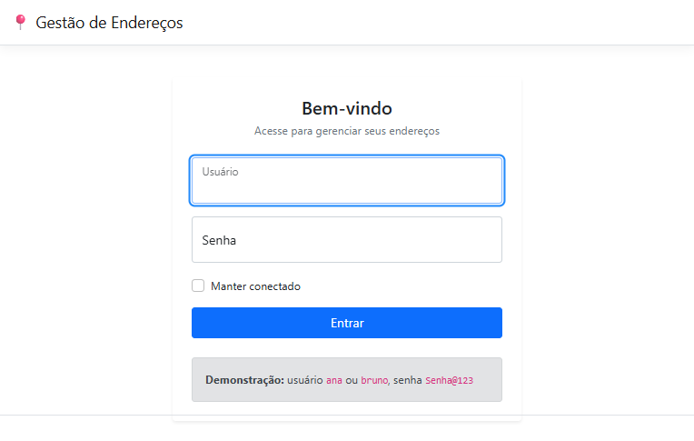
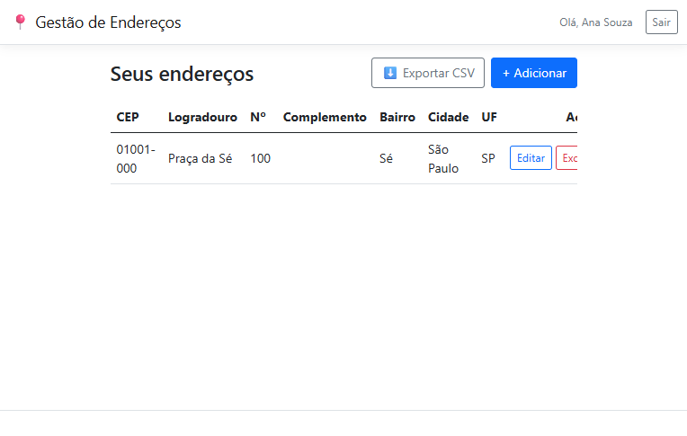
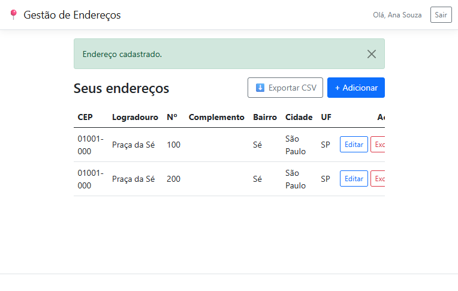
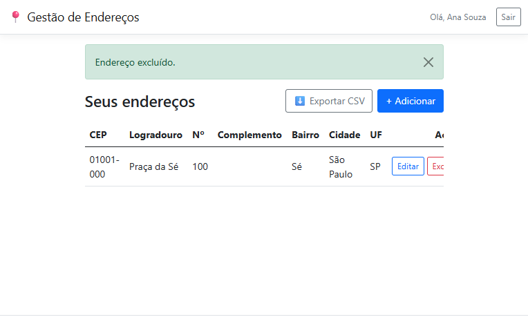
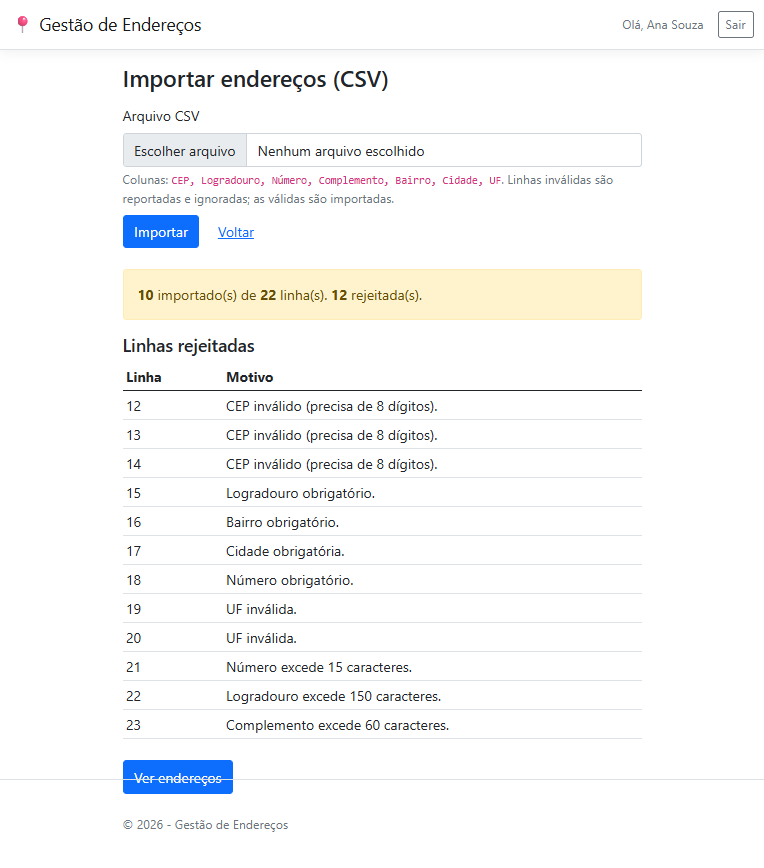
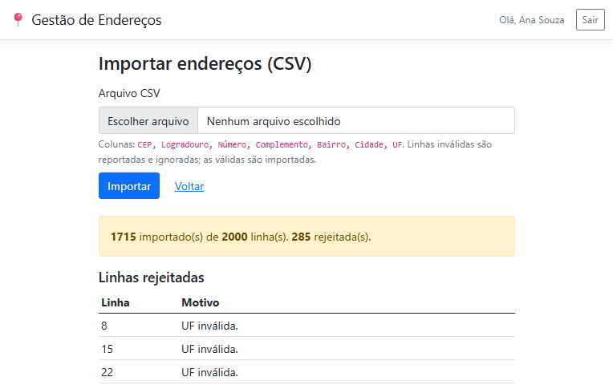

# Dossiê de Entrega — Teste Técnico Dev C#
## Gestão de Endereços

> Documento de apoio à avaliação. Reúne links, instruções, aderência ao enunciado, decisões de
> arquitetura, documentação de testes e **evidências de validação ponta a ponta** (inclusive
> testes em navegador simulando o uso humano).

---

## 1. Acesso rápido

| Item | Link / valor |
|------|--------------|
| **Repositório (público)** | https://github.com/alucardigo/gestao-enderecos |
| **Demo ao vivo** | http://129.151.35.75:8080 |
| **Credenciais de demonstração** | `ana` / `Senha@123` · `bruno` / `Senha@123` |
| **Stack** | ASP.NET Core MVC (.NET 8 LTS), EF Core 8, SQL Server, Bootstrap 5, xUnit |

> A demo ao vivo roda em uma instância Oracle Cloud (ARM) com SQLite (custo zero); o repositório e
> o `docker-compose` usam **SQL Server** — o provider é selecionável por configuração, sem alterar o código.

---

## 2. Como executar (3 formas)

**a) Docker — um comando (recomendado, sobe SQL Server + app):**
```bash
git clone https://github.com/alucardigo/gestao-enderecos.git
cd gestao-enderecos
docker compose up --build      # acesse http://localhost:8080
```

**b) .NET SDK local + SQL Server (LocalDB/Express/container):**
```bash
cd src/GestaoEnderecos
dotnet run                     # cria schema e popula demo automaticamente
```

**c) Demo ao vivo:** abra http://129.151.35.75:8080 e entre com `ana`/`Senha@123`.

Em todos os casos os dados de demonstração são criados automaticamente na primeira execução.
Alternativamente, o schema pode ser criado pelo script `db/scripts/01-create-tables.sql`.

---

## 3. Aderência ao enunciado (item a item)

| Requisito da AeC | Status | Onde |
|------------------|:------:|------|
| Aplicação web em C# | ✅ | ASP.NET Core MVC |
| Tela de login — autenticação | ✅ | `AccountController`, cookie auth |
| Tela de login — validação de credenciais | ✅ | `AutenticacaoService` + `PasswordHasher` |
| Redirecionar para endereços após login | ✅ | `AccountController.Login` |
| CRUD — adicionar | ✅ | `EnderecosController.Create` |
| CRUD — visualizar (listar) | ✅ | `EnderecosController.Index` |
| CRUD — editar | ✅ | `EnderecosController.Edit` |
| CRUD — excluir | ✅ | `EnderecosController.Delete` (com modal de confirmação) |
| Campos: cep, logradouro, complemento (opcional), bairro, cidade, uf, numero | ✅ | `Endereco`, `EnderecoFormViewModel` |
| Inserir manual **ou** buscar por CEP (ViaCEP) | ✅ | `ViaCepService` + `cep.js` |
| Exportar para CSV | ✅ | `CsvExporter` + `EnderecosController.Exportar` |
| Tabela **Usuários** (Id, nome, usuário, senha) | ✅ | `db/scripts/01-create-tables.sql` * |
| Tabela **Endereços** (Id, cep, logradouro, complemento, bairro, cidade, uf, numero, idUsuário) | ✅ | idem |
| **Enviar apenas os scripts de criação das tabelas** | ✅ | `db/scripts/01-create-tables.sql` |
| Tecnologias sugeridas (ASP.NET MVC, EF, HTML/CSS/JS, SQL Server) | ✅ | todas adotadas |
| Repositório público no GitHub | ✅ | link acima |
| README.md com a descrição do teste | ✅ | `README.md` |
| **Um commit por funcionalidade** | ✅ | histórico (seção 7) |
| **Extra (além do enunciado): importação CSV** com validação por linha | ✅ | `EnderecoImportService` + planilha de exemplo |

> \* A coluna `senha` foi nomeada `SenhaHash` e armazena **apenas o hash** da senha (PBKDF2),
> nunca o texto puro — melhoria de segurança documentada no próprio script.

---

## 4. Arquitetura e principais decisões

- **Monólito bem organizado** (um projeto MVC, pastas por responsabilidade) em vez de Clean
  Architecture multi-projeto: para 2 entidades e 1 integração, o EF Core já é o repositório;
  camadas extras seriam cerimônia. Demonstra calibragem, não falta de conhecimento.
- **Segurança da senha** com `PasswordHasher` nativo do framework (PBKDF2-HMAC-SHA256) — sem
  reinventar criptografia e sem o peso do ASP.NET Core Identity completo.
- **Isolamento entre usuários** por **EF Global Query Filter**: nenhuma consulta — nem leitura,
  nem edição, nem exclusão — enxerga endereço de outro usuário. O vazamento (IDOR) é **impossível
  por construção**, não por disciplina. Provado por teste automatizado e por teste HTTP.
- **ViaCEP via endpoint interno** (typed `HttpClient`, assíncrono, timeout 5s) com degradação
  graciosa: se a API externa falhar, o cadastro manual continua possível.
- **CSV com CsvHelper** (UTF-8 com BOM) — mesma régua de "não reinventar o que já está resolvido"
  (consistente com a escolha de não escrever criptografia à mão).
- **Provider de banco configurável** (`Database:Provider`): SQL Server (padrão) ou SQLite, sem
  alterar o código — habilita ambientes leves/ARM.

Decisões registradas como ADRs no diretório de planejamento do projeto.

---

## 5. Segurança (resumo)

| Vetor | Mitigação |
|-------|-----------|
| Senha | Hash PBKDF2 com salt por registro (`PasswordHasher`); nunca em texto puro |
| Sessão | Cookie `HttpOnly`; `Secure` em produção; expiração + sliding |
| IDOR / vazamento entre usuários | EF Global Query Filter (cobre leitura e escrita) |
| CSRF | `[ValidateAntiForgeryToken]` em todas as mutações + token nos forms |
| XSS | Encoding automático do Razor; JS usa `textContent` |
| SQL Injection | EF Core parametriza 100% das consultas |
| Segredos | Connection string via User-Secrets/variável de ambiente |

---

## 6. Qualidade e testes

**Quality gates** (rodam a cada build e no CI do GitHub Actions):
`dotnet format` (estilo) · `dotnet build -warnaserror` (zero avisos) · `dotnet test`.

**Suíte automatizada: 56 testes, 100% verdes.** Cirúrgicos — cada um pega um bug real do escopo.

### Testes unitários (42)
- **Autenticação (5):** senha correta passa; senha incorreta falha; usuário inexistente falha;
  login case-insensitive; hash armazenado não é a senha em texto puro.
- **Exportação CSV (7):** BOM UTF-8 presente; cabeçalho correto; CEP formatado; campo com vírgula
  entre aspas; aspas internas duplicadas; quebra de linha entre aspas; complemento vazio vira campo
  vazio (não a palavra "null").
- **Normalização de CEP/UF (7):** remove máscara/pontos/espaços em vários formatos; persiste CEP só
  com dígitos e UF em maiúsculas.
- **Integração ViaCEP (9):** mapeia `localidade`→cidade; CEP inexistente com `erro` em string e em
  bool retorna "não encontrado"; status 500, timeout e falha de rede degradam sem estourar; CEP
  inválido nem chama a API.
- **Importação CSV (14):** linha válida importa; CEP inválido, UF fora das 27, campos obrigatórios e
  tamanhos excedidos são rejeitados com motivo; CEP/UF normalizados; vírgula entre aspas e cabeçalho
  sem acento; arquivo só com cabeçalho não importa nada; importados pertencem ao usuário;
  **carga de 1000 linhas**.

### Testes de integração (14) — sobem a aplicação real (`WebApplicationFactory`)
- **Login (6):** login válido redireciona à lista; login inválido mostra "Credenciais inválidas";
  4 rotas protegidas redirecionam o anônimo para o login.
- **Fluxo de endereços (5):** criar→listar→exportar CSV; `BuscarCep` existente retorna JSON;
  `BuscarCep` inexistente retorna 404; **importação via HTTP (multipart)** com válidas+inválidas;
  **usuário não acessa endereço de outro via HTTP** (IDOR).
- **Isolamento (3):** usuário só enxerga os próprios endereços; não obtém por id alheio; não edita
  nem exclui de outro.

---

## 7. Validação ponta a ponta com comportamento humano (navegador real)

Além dos testes automatizados, o fluxo completo foi exercido em um **navegador real (Playwright)**,
simulando o uso humano, **contra a aplicação rodando com SQL Server no Docker**. Console do
navegador: **0 erros, 0 avisos**. Evidências em `evidencias/`:

| # | Passo validado | Evidência |
|---|----------------|-----------|
| 1 | Tela de login (card, floating labels, credenciais demo) | `evidencias/01-login.png` |
| 2 | Login bem-sucedido → lista de endereços | `evidencias/02-lista.png` |
| 3 | **CEP digitado → autopreenchimento automático + foco pula para "Número"** | `evidencias/03-cep-autofill.png` |
| 4 | Endereço salvo → aviso de sucesso e item na lista | `evidencias/04-criado-toast.png` |
| 5 | Exclusão → modal citando o endereço real ("Praça da Sé, 200?") | `evidencias/05-modal-exclusao.png` |
| 6 | Exclusão confirmada → item removido + aviso | `evidencias/06-excluido.png` |
| 7 | Demo em produção (Oracle Cloud) acessível | `evidencias/07-producao-oci.png` |
| 8 | **Importação CSV — 10 válidas importadas, 12 inválidas com linha + motivo** | `evidencias/08-import-relatorio.png` |
| 9 | **Importação massiva — 1715 de 2000 importadas, 285 rejeitadas** | `evidencias/09-import-massivo.png` |

Edição também validada (adição de complemento "Apto 42" persistida). A integração ViaCEP foi
exercida com a **API real** (servidor com internet), retornando "Praça da Sé / São Paulo".

### Capturas

**1. Tela de login**


**2. Lista de endereços (após login)**


**3. Autopreenchimento por CEP — campos preenchidos e foco em "Número"**


**4. Endereço cadastrado (aviso de sucesso)**


**5. Confirmação de exclusão citando o endereço real**


**6. Endereço excluído**


**7. Demo em produção (Oracle Cloud)**


**8. Importação CSV — válidas importadas, inválidas reportadas (linha + motivo)**


**9. Importação massiva (2000 linhas) — 1715 importadas, 285 rejeitadas**


---

## 8. Estrutura do repositório

```
gestao-enderecos/
├── README.md                     # descrição + como rodar + decisões
├── docker-compose.yml            # SQL Server + app, um comando
├── Dockerfile                    # build multi-stage .NET 8
├── .github/workflows/ci.yml      # CI: format + build + test
├── db/scripts/01-create-tables.sql   # DDL (entregável do enunciado)
├── src/GestaoEnderecos/          # aplicação MVC
│   ├── Controllers/ Services/ Data/ Models/ ViewModels/ Views/ wwwroot/
└── tests/GestaoEnderecos.Tests/  # 41 testes (Unit + Integration)
```

Histórico de commits (um por funcionalidade + suporte atômico):
```
feat: autenticação por cookie com PasswordHasher
feat: CRUD de endereços com isolamento por usuário
feat: autopreenchimento por CEP via ViaCEP (proxy interno)
feat: exportação CSV (CsvHelper + UTF-8 com BOM)
docs/build/chore: README, Docker, CI, ajustes de revisão
```

---

## 9. Garantias e ressalvas (transparência)

**Garantido, com evidência:**
- Build sem avisos; **56 testes automatizados passando**.
- Login, CRUD completo, ViaCEP, CSV e **importação** (inclusive **massiva de 2000 linhas**)
  funcionando **em navegador real** (SQL Server no Docker) e na demo ao vivo.
- Isolamento entre usuários provado (automatizado + HTTP).
- `docker compose up` sobe o ambiente completo (SQL Server + app) validado.
- Repositório público, histórico limpo (working tree sem pendências), 124 arquivos versionados.

**Ressalvas honestas (não varridas para baixo do tapete):**
- A **demo ao vivo** usa **SQLite** e **HTTP** (sem TLS) — escolha de simplicidade/custo; o
  repositório e o `docker-compose` usam **SQL Server** (entrega fiel ao enunciado).
- A **segurança** é adequada ao escopo de um teste técnico — não é um pentest formal.
- **Performance/carga** não foi alvo de testes (fora do escopo).
- A senha do SQL Server no `docker-compose.yml` é de **container local descartável** (padrão em
  ambientes de desenvolvimento), não um segredo de produção.
