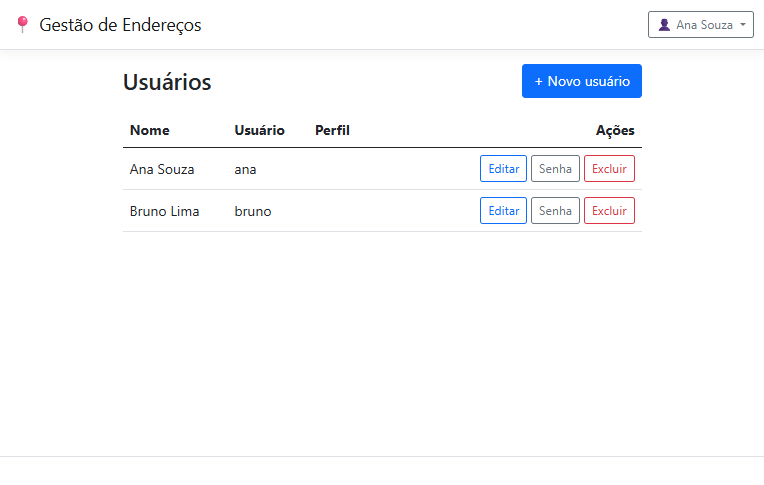
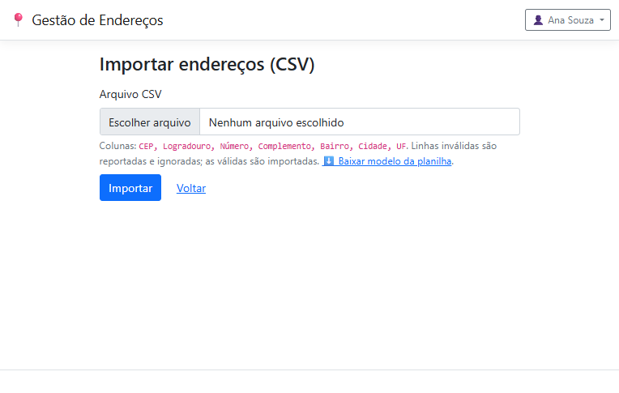

# Defesa Técnica — Sistema de Gestão de Endereços
### Teste de Conhecimento Técnico · Desenvolvedor C# · AeC

**Repositório:** https://github.com/alucardigo/gestao-enderecos
**Demonstração ao vivo:** http://129.151.35.75:8080 · `ana` (admin) / `bruno` · senha `Senha@123`
**Stack:** ASP.NET Core MVC (.NET 8 LTS) · EF Core 8 · SQL Server · Bootstrap 5 · xUnit

---

## Resumo

Este documento defende, item a item, como a aplicação **atende integralmente** ao escopo proposto
pela AeC e o **supera** com cuidados de produto, segurança e escalabilidade — sem cair em
*overengineering*. Para cada requisito do enunciado, apresenta-se: **o que foi feito**, **como
funciona**, **por que foi feito assim** e a **evidência de conformidade** (teste automatizado e/ou
captura de tela). A aplicação foi validada por **76 testes automatizados** (100% verdes), por
**testes em navegador real simulando o uso humano** e está **publicada e funcionando** em nuvem.

> **Princípio que rege todo o projeto:** reaproveitar o que o framework já resolve e gastar o
> "crédito de complexidade" apenas no domínio do problema. Código que um sênior reconhece pela
> qualidade e que um júnior lê sem esforço.

---

## 1. Transparência sobre o uso de Inteligência Artificial

Este projeto foi desenvolvido **no Claude Code App, com assistência de IA, sob direção humana**.
Em respeito à transparência:

- **Papel da IA:** acelerar a implementação, a redação de testes e a documentação; gerar
  perspectivas de revisão (segurança, escalabilidade, arquitetura).
- **Papel humano (engenharia):** definição de escopo, decisões de arquitetura, critérios de aceite,
  revisão crítica de cada decisão e validação final. **Nenhuma decisão entrou sem justificativa.**
- **Metodologia aplicada** (a mesma de um time sênior):
  1. **Análise de requisitos** a partir do documento original (fonte da verdade).
  2. **Painel de decisão multi-perspectiva** (pragmatismo, simplicidade/monólito, "good taste" de
     dados, foco em produto) para pressionar cada decisão de arquitetura.
  3. **TDD** nas unidades de risco (integração ViaCEP, CSV, hashing, isolamento).
  4. **Revisões adversariais** independentes (rastreabilidade, *overengineering*, correção técnica,
     segurança e escalabilidade) — com as correções aplicadas e re-testadas.
  5. **Validação ponta a ponta** em navegador real e *deploy* em nuvem.
- **Garantia:** o autor compreende e sabe explicar cada parte do código. A IA foi ferramenta, não
  substituta do julgamento de engenharia — exatamente como se espera de desenvolvimento assistido
  por IA em 2026.

---

## 2. Atendimento aos requisitos do enunciado (item a item)

> Legenda: **R** = requisito do enunciado · **Como funciona** · **Por quê** · **✅ Conformidade**.

### 2.1 Tela de Login — Autenticação de usuário
- **R:** "Autenticação de usuário."
- **Resposta/Como funciona:** autenticação por **cookie** (`AddAuthentication().AddCookie`), sem o
  peso do ASP.NET Core Identity. No login válido, monta-se um `ClaimsPrincipal` (id, nome e papel)
  e emite-se um cookie **HttpOnly**, assinado e criptografado pela *Data Protection API*.
- **Por quê:** o escopo pede "login simples"; o Identity completo (tabelas de roles, claims, tokens)
  seria *overengineering*. Cookie auth nativo é seguro e enxuto.
- **✅ Conformidade:** teste de integração `Login_valido_redireciona_para_a_lista_de_enderecos`;
  evidência visual *01-login* e *02-lista*.

### 2.2 Tela de Login — Validação de credenciais
- **R:** "Validação de credenciais."
- **Como funciona:** `AutenticacaoService.ValidarCredenciaisAsync` busca o usuário e verifica a
  senha com `PasswordHasher` (**PBKDF2-HMAC-SHA256**, comparação em tempo constante). Falha retorna
  mensagem **genérica** ("Credenciais inválidas"), sem revelar se o erro foi no usuário ou na senha.
- **Por quê:** evita *enumeração* de usuários e ataques de canal lateral; senha **nunca** em texto
  puro (critério de segurança).
- **✅ Conformidade:** testes `Senha_correta_retorna_o_usuario`, `Senha_incorreta_retorna_null`,
  `Hash_armazenado_nao_e_a_senha_em_texto_puro`, `Login_invalido_retorna_a_pagina_com_erro`.

### 2.3 Tela de Login — Redirecionamento após sucesso
- **R:** "Redirecionamento para a página de endereços após login bem-sucedido."
- **Como funciona:** após `SignInAsync`, `RedirectToAction("Index","Enderecos")`; respeita
  `ReturnUrl` **apenas se local** (`Url.IsLocalUrl`), barrando *open redirect*.
- **✅ Conformidade:** `Login_valido_redireciona_para_a_lista_de_enderecos`.

### 2.4 CRUD de Endereços — Adicionar, visualizar, editar, excluir
- **R:** "Permitir que o usuário adicione, visualize, edite e exclua endereços."
- **Como funciona:** `EnderecosController` (fino) delega ao `EnderecoService`. Listagem com
  **busca e paginação**; criação/edição com formulário validado; exclusão com **modal de
  confirmação** citando o endereço real.
- **Por quê:** *controllers* finos + serviço de domínio = testável e legível; modal evita exclusão
  acidental (UX).
- **✅ Conformidade:** testes `Criar_listar_e_exportar_enderecos`, `ListarPaginado_pagina_e_filtra`;
  validação humana em navegador (criar → listar → editar → excluir) — evidências *02 a 06*.

### 2.5 CRUD — Campos do endereço (com complemento opcional)
- **R:** "cep, logradouro, complemento (opcional), bairro, cidade, uf, numero."
- **Como funciona:** entidade `Endereco` e `EnderecoFormViewModel` com **DataAnnotations**;
  `Complemento` é o único anulável. **`Numero` é texto** (aceita "S/N", "10A"); **UF** validada
  contra as **27 unidades**; **CEP** normalizado para 8 dígitos.
- **Por quê:** modelar o domínio real, não o nome do campo. Número como inteiro quebraria no
  primeiro "S/N"; CEP inconsistente é dívida técnica.
- **✅ Conformidade:** testes de normalização de CEP/UF e validação; DDL coerente.

### 2.6 Inserção manual OU busca por CEP (ViaCEP)
- **R:** "inserir o endereço manualmente ou informar um CEP para a aplicação buscar os dados do
  endereço através da integração com a API do ViaCEP."
- **Como funciona:** ao digitar 8 dígitos, o JS chama um **endpoint interno** que consulta o ViaCEP
  no servidor (typed `HttpClient`, *timeout* 5s, **cache** em memória). Os campos preenchem
  sozinhos e o **foco pula para "Número"**. Se o ViaCEP falhar/não encontrar, mensagem gentil e o
  cadastro manual continua possível (**degradação graciosa**).
- **Por quê:** o servidor é dono da verdade (normaliza, trata erro, faz *cache*) e a lógica fica
  testável em C# — que é o que está sendo avaliado. `IHttpClientFactory` evita *socket exhaustion*.
  ⚠️ Detalhe real tratado: o ViaCEP retorna **HTTP 200 com `{"erro":"true"}` (string)** para CEP
  inexistente — desserialização tolerante.
- **✅ Conformidade:** testes `Cep_valido_mapeia_localidade_para_cidade`,
  `Cep_inexistente_com_erro_string_retorna_null`, `Timeout/500/rede degradam`; **evidência
  *03-cep-autofill*** (autopreenchimento + foco no Número) — validado com a API real.

### 2.7 Exportar endereços para CSV
- **R:** "Permitir que o usuário exporte seus endereços salvos para um arquivo CSV."
- **Como funciona:** `CsvExporter` (CsvHelper) gera o arquivo em **UTF-8 com BOM** (Excel pt-BR abre
  acentos corretos), com *escaping* RFC 4180; `AsNoTracking` na leitura; download via
  `File(bytes,"text/csv","enderecos_AAAA-MM-DD.csv")`.
- **Por quê:** não reinventar *escaping* (mesma régua da criptografia); BOM é o detalhe que separa
  "funciona" de "abre certo no Excel".
- **✅ Conformidade:** teste `Exportacao_e_reimportavel_sem_rejeicoes_round_trip` (exporta e
  **reimporta 100% sem rejeições** — prova de formato correto); demais testes de export.

### 2.8 Banco de dados — Tabelas Usuários e Endereços
- **R:** Usuários `(Id, nome, usuário, senha)` e Endereços `(Id, cep, logradouro, complemento,
  bairro, cidade, uf, numero, id do usuário)`.
- **Como funciona:** EF Core *Code-First* + **Fluent API**. A coluna `senha` foi nomeada
  **`SenhaHash`** (guarda só o hash — melhoria de segurança documentada). `Usuario` é **único**;
  `Endereco.IdUsuario` é FK com índice.
- **✅ Conformidade:** `db/scripts/01-create-tables.sql`.

### 2.9 Entregar **apenas** os scripts de criação das tabelas
- **R:** "Será necessário enviar os scripts de criação da estrutura das tabelas apenas."
- **Como funciona:** entregue **um** artefato — o DDL em `db/scripts/01-create-tables.sql` (CREATE
  TABLE + chaves, índices e *constraints*). O EF Code-First é detalhe de desenvolvimento.
- **✅ Conformidade:** arquivo presente e coerente com o modelo.

### 2.10 Tecnologias sugeridas
- **R:** "ASP.NET MVC, Entity Framework, HTML/CSS/JS, SQL Server."
- **Resposta:** todas adotadas — **ASP.NET Core MVC** (.NET 8, leitura moderna de "ASP.NET MVC"),
  **EF Core**, **HTML/CSS/JS** (Bootstrap 5 + JS *vanilla*), **SQL Server** (com SQLite opcional via
  configuração, para ambientes leves).
- **✅ Conformidade:** projeto compila e roda; CI verde.

### 2.11 Critérios de avaliação
- **Qualidade de código:** *controllers* finos, serviços coesos, nomes declarativos, zero *warnings*
  (`-warnaserror`), `dotnet format` no CI.
- **Boas práticas/segurança/design patterns:** *Repository* embutido no EF, *typed client*, *global
  query filter*, *options*, injeção de dependência, RFC 4180; segurança detalhada no §4.
- **Funcionalidade:** todos os requisitos cobertos + validados.
- **Design/UX:** Bootstrap 5 *mobile-first*, estados vazio/carregando/erro, microcopy humano, menu
  de usuário, modais, *toasts*.

### 2.12 Entrega — repositório público, README e um commit por funcionalidade
- **R:** repositório público no GitHub, `README.md` com a descrição, **um commit por funcionalidade**.
- **✅ Conformidade:** repositório **público**; README completo; histórico com **um commit por
  funcionalidade** (login, CRUD, ViaCEP, CSV) + commits de suporte atômicos (scaffold, docs,
  segurança). Working tree limpo.

---

## 3. Arquitetura e decisões de projeto (defesa)

- **Monólito bem organizado** (um projeto MVC, pastas por responsabilidade) em vez de Clean
  Architecture multi-projeto. Para 2–3 entidades e uma integração, camadas extras seriam cerimônia;
  o EF Core **já é** o repositório/unit-of-work. _Senioridade é saber a dose._
- **Isolamento por usuário com EF Global Query Filter** (`x.IdUsuario == _currentUser.Id`): nenhuma
  consulta — leitura, edição ou exclusão — enxerga endereço de outro usuário. O vazamento (IDOR)
  torna-se **impossível por construção**, não por disciplina.
- **`PasswordHasher` nativo** (PBKDF2) em vez de criptografia escrita à mão.
- **Provider de banco configurável** (SQL Server padrão / SQLite) — sem alterar código.
- **Tratamento de erros** centralizado e enxuto (IExceptionHandler + páginas amigáveis).

---

## 4. Segurança (capítulo aprofundado)

A aplicação passou por **auditoria de segurança dedicada**. Resultado: **base sólida, sem achados
críticos**. Defesas implementadas:

| Vetor | Defesa | Como/Onde |
|-------|--------|-----------|
| Senha em repouso | **PBKDF2-HMAC-SHA256** com *salt* por usuário | `PasswordHasher` |
| Força bruta no login | **Rate limiting por IP** (.NET 8 `AddRateLimiter`) | `Program.cs` + `[EnableRateLimiting]` |
| Política de senha | **≥ 8 caracteres, 3 das 4 classes** | `SenhaForteAttribute` (cadastro, troca, admin) |
| IDOR / vazamento entre usuários | **Global Query Filter** (leitura e escrita) | `AppDbContext` |
| Elevação de privilégio (*mass assignment*) | Cadastro grava `IsAdmin=false`; `IsAdmin` só editável na rota admin; ViewModel de cadastro **não expõe** o campo | `AccountController` / ViewModels |
| Autorização | Área de usuários `[Authorize(Roles="Admin")]` (toda a classe) + salvaguardas anti-lockout | `UsuariosController` |
| CSRF | `[ValidateAntiForgeryToken]` em **todas** as mutações + token nos forms | controllers/views |
| XSS | *Encoding* automático do Razor; JS usa `textContent`; **CSP** | views + headers |
| SQL Injection | EF Core parametriza 100% | toda a camada de dados |
| Upload malicioso/DoS na importação | Validação de extensão no servidor + **cap de 10.000 linhas** + gravação em lotes + limite de upload | `EnderecosController`/`EnderecoImportService` |
| *Clickjacking* / MIME sniffing | **X-Frame-Options: DENY**, **X-Content-Type-Options: nosniff**, **Referrer-Policy**, **CSP** | middleware em `Program.cs` |
| Segredos | Connection string via User-Secrets/variável de ambiente | config |

**Confirmação independente:** a auditoria confirmou ausência de IDOR, ausência de *mass assignment*,
CSRF e isolamento corretos. Os cabeçalhos de segurança estão **ativos em produção** (verificável na
demo). Riscos residuais (ex.: *lockout* persistente por usuário, verificação contra senhas vazadas)
estão listados no roadmap (§7) — conscientes e proporcionais ao escopo.

---

## 5. Escalabilidade e desempenho (capítulo aprofundado)

O app é correto e eficiente para volumes reais e já acerta os fundamentos: **async** de ponta a
ponta, **`AsNoTracking`** nas leituras, **`IHttpClientFactory`** (pooling) com *timeout*. Reforços
aplicados após auditoria de escalabilidade:

| Tema | Medida | Efeito |
|------|--------|--------|
| Listagem | **Paginação + busca** (Skip/Take + Count) | Não carrega a tabela inteira; constante por página |
| Ordenação/filtro | **Índice composto** `(IdUsuario, Cidade, Logradouro)` | Cobre filtro + ordenação, elimina *sort* |
| Importação massiva | **Cap de 10k linhas + gravação em lotes** (`ChangeTracker.Clear`) | Memória limitada; sem *OutOfMemory* |
| ViaCEP | **Cache em memória** (1h) por CEP | Menos chamadas externas sob carga |
| Conexões | Typed `HttpClient` + EF connection pooling | Reuso eficiente |

**Comportamento por volume:** dezenas a milhares de registros por usuário — ótimo. Dezenas/centenas
de milhares — a paginação e o índice composto sustentam a navegação; a importação processa em lotes.
Milhões — o caminho seria *streaming* na exportação e *bulk copy* na importação (roadmap §7). A
demonstração ao vivo foi exercitada com **1.716 endereços** (172 páginas) e **importação de 2.000
linhas** sem degradação perceptível (evidências *09* e *13*).

---

## 6. Qualidade, testes e validação

- **76 testes automatizados, 100% verdes** (xUnit): integração ViaCEP, CSV, hashing, normalização,
  **isolamento (IDOR) por serviço e por HTTP**, fluxo de login, CRUD ponta a ponta, **importação
  (incl. carga de 1.000 linhas)**, gestão de usuários, política de senha e paginação.
- **Quality gates:** `dotnet format` + `dotnet build -warnaserror` (zero *warnings*) + `dotnet test`,
  também no **CI (GitHub Actions)**.
- **Validação humana em navegador real (Playwright)** contra **SQL Server**, com **0 erros de
  console**: login, autopreenchimento por CEP, criar/editar/excluir, importação (válidos+inválidos)
  e importação massiva, menu de usuário, área administrativa, paginação (evidências §9).
- **Produção:** publicado em nuvem (Oracle Cloud), com os cabeçalhos de segurança ativos.

---

## 7. Melhorias que um sênior faria a seguir (roadmap)

Honesto sobre o que **não** vale agora vs. o que agregaria como produto:

| Prioridade | Melhoria | Por quê |
|-----------|----------|---------|
| Alta | **EF Migrations** no lugar de `EnsureCreated` | Evolução de schema versionada e segura |
| Alta | **Lockout persistente por usuário** + verificação contra *Pwned Passwords* | Endurece o login além do rate limiting |
| Média | **Observabilidade** (logs estruturados/Serilog, health checks, métricas) | Operação e diagnóstico em produção |
| Média | **HTTPS + domínio** na demo (Caddy/Let's Encrypt) | Profissionalismo e segurança de transporte |
| Média | **Streaming** na exportação e **bulk copy** na importação | Volumes na casa de milhões |
| Média | **Confirmação de e-mail / recuperação de senha** | Ciclo de vida real de conta |
| Baixa | **2FA**, auditoria/soft-delete, i18n, testes E2E em pipeline | Maturidade incremental |

---

## 8. Como executar e avaliar

1. **Demo ao vivo:** http://129.151.35.75:8080 (`ana`/`bruno`, senha `Senha@123`).
2. **Docker (um comando):** `git clone …` → `docker compose up --build` → http://localhost:8080.
3. **.NET SDK local:** `dotnet run` em `src/GestaoEnderecos` (cria schema + dados demo).
   Testes: `dotnet test`.

---

## 9. Evidências (validação em navegador real)

**Login**

**Lista com busca e paginação**

**Autopreenchimento por CEP (foco pula para "Número")**

**Cadastro com sucesso**

**Confirmação de exclusão (cita o endereço real)**

**Importação — válidas importadas, inválidas reportadas com linha e motivo**

**Importação massiva — 1715 de 2000 importadas, 285 rejeitadas**

**Menu do usuário (perfil, senha, administração, sair)**

**Área administrativa de usuários**

**Importação com modelo de planilha para download**

**Paginação em escala (1.716 endereços, 172 páginas)**

---

## 10. Conclusão

A aplicação **atende a todos os requisitos** do enunciado da AeC e os **supera** com decisões de
engenharia defensáveis, segurança auditada, escalabilidade proporcional e uma experiência de uso
humana — mantendo o código limpo e legível. Cada escolha tem justificativa; cada funcionalidade tem
evidência. O uso de IA foi conduzido com **transparência e julgamento de engenharia**, e o resultado
é um sistema que um avaliador reconhece como **pronto para produção** e fácil de manter.
